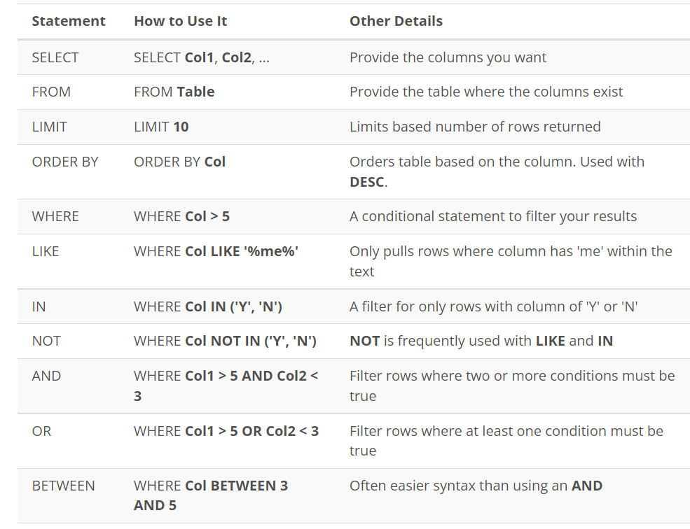

# SQL Complite Analysis

### SQL query perform in this table
 Commands
 1. DDL
 2. DCL
 3. DML
 4. Join
 5. Analytic Fuction (window)
 6. procedure
 7. functions
## ER diagram

SQL query perform in this table
1. sum
2. James Monroe
3. John Quincy Adams

